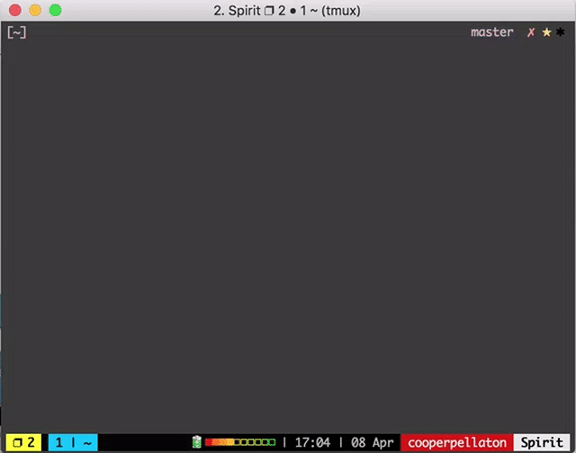

# A Lambda event to create signed URLs for S3.

## See it in action.


## What this is.
Have you ever used [AWS Lambda](https://aws.amazon.com/lambda/)? If you have, you know it's incredibly powerful, and if you haven't you should know that it will change your life. No more do you need to manage servers to deploy your API, instead can just deploy your API without the headache.

What we have here is a Lambda event on which you can call it's endpoint to get a signed S3 upload link. Esentially this is secure, easy, fast file upload 100% put on AWS. In 13 lines of code you have an API to get secure PUT links on which you can call to place a file into a specified bucket.

This trigger is the final embodiment of the PrintShare API, one completely dependent on Amazon and without the hassle of writing anything more complicated or error prone. 

## Invoke it.
You can invoke it by calling this:
```
curl -v -H "Content-Type: application/json" -X POST -d "{\"name\":\"YOURPDFNAMEHERE.pdf\",\"type\":\"application/pdf\"}" YOURENDPOINTGOESHERE.com
```
You'll get back a signed URL that you can pull a `PUT` on. Upload that file and go see it in your bucket!
